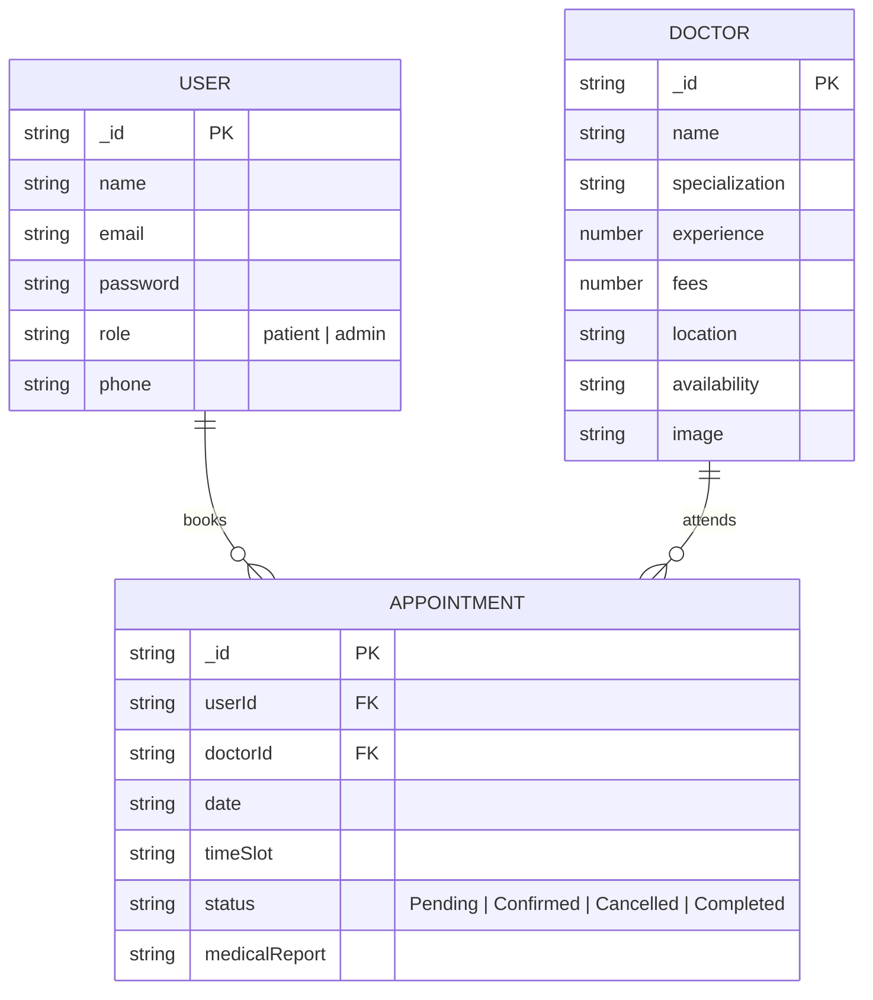

# 📅 BOOK-A-DOCTOR

**Book-A-Doctor** is your one-stop destination for effortless online doctor appointment booking. Designed and implemented with clean MERN Stack architecture (MongoDB, Express, React, Node.js) and modern visual design aesthetics.

---

## 🔗 DEMO AND GITHUB REPOSITORY LINKS

> [!IMPORTANT]
> - 🌐 **Live Vercel Frontend App:** [https://book-a-doctor-silk.vercel.app](https://book-a-doctor-silk.vercel.app)
> - 👨‍⚕️ **Browse Doctors:** [https://book-a-doctor-silk.vercel.app/doctors](https://book-a-doctor-silk.vercel.app/doctors)
> - ⚡ **Live Render Backend API:** [https://book-a-doctor-h6gh.onrender.com](https://book-a-doctor-h6gh.onrender.com)
> - 📦 **GitHub Repository:** [https://github.com/harineem2006/BOOK-A-DOCTOR](https://github.com/harineem2006/BOOK-A-DOCTOR)
> - 🔑 **Pre-configured Admin Account:**
>   - **Account Email:** `admin@gmail.com`
>   - **Password:** `admin123`

---

## 1. PROJECT ARCHITECTURE

### TECHNICAL ARCHITECTURE

The application follows a decoupled client-server architecture:

```
+-----------------------------------------------------------------------+
|                            FRONTEND LAYER                             |
|  - React 18                                                           |
|  - Custom CSS Design System & Responsive Layout Tokens                |
|  - Context API (AuthContext)                                          |
|  - React Router DOM Navigation                                        |
|  - Pages: Home, Doctors, DoctorProfile, BookAppointment,              |
|          MyAppointments, UploadReports, AdminLogin, AdminDashboard    |
+-----------------------------------------------------------------------+
                                    |
                                    | REST API (HTTP / JSON / JWT)
                                    v
+-----------------------------------------------------------------------+
|                            BACKEND LAYER                              |
|  - Node.js & Express.js REST API Server                               |
|  - JWT Authentication & Bcrypt Hashing Middleware                     |
|  - Controllers: AuthController, DoctorController,                     |
|                AppointmentController, AdminController, UploadController|
+-----------------------------------------------------------------------+
                                    |
                                    | Mongoose ORM
                                    v
+-----------------------------------------------------------------------+
|                            DATABASE LAYER                             |
|  - MongoDB (Users, Doctors, Appointments)                             |
+-----------------------------------------------------------------------+
```

---

### ER DIAGRAM



---

### FEATURES

1. **Comprehensive Doctor Catalog**: Extensive listing of certified doctors across specializations (Cardiology, Dermatology, Pediatrics, Neurology, Orthopedics) with real-time filtering, search keyword matching, experience level, and fee sorting.
2. **Book Appointment Flow**: Direct appointment booking workflow where patients select a doctor, pick their desired date and available time slot, and submit booking requests instantly.
3. **Medical Reports Upload**: Secure file upload system for medical reports and lab documents associated directly with appointment records using Cloudinary and Multer.
4. **User Profile & Tracking**: Dedicated patient dashboard displaying appointment history alongside live status updates (`Pending`, `Confirmed`, `Completed`, `Cancelled`).
5. **Unified Admin Console (`admin@gmail.com` / `admin123`)**:
   - **Doctor Management**: Add new doctors, update specializations, edit pricing/schedules, and remove doctor listings.
   - **Appointment Oversight**: View all platform bookings and update appointment status.
   - **User Management**: Monitor registered user accounts.

---

### USER FLOW

```
[ Visitor / Patient ]
         |
         v
[ Browse Home / Doctor Catalog ]
         |
         +----> Click "Doctor Profile" ---> View Specialization, Fees & Schedule
         |
         +----> Click "Book Appointment" ---> Select Date, Slot & Upload Reports
                                                     |
                                                     v
                                            [ Appointment Booked ]
                                                     |
                                                     v
                                          [ Track Status in Dashboard ]
```

---

### MVC PATTERN EXPLANATION

- **Model Layer (`server/models/`)**: Mongoose models defining data schemas for `User.js`, `Doctor.js`, and `Appointment.js`.
- **View Layer (`client/src/`)**: Dynamic React components rendered with CSS styling, responsive grid structures, and interactive UI states.
- **Controller Layer (`server/controllers/`)**: Business logic processing incoming API requests, performing database CRUD operations, and returning structured JSON responses (`authController.js`, `doctorController.js`, `appointmentController.js`, `adminController.js`, `uploadController.js`).

---

## 2. PROJECT SETUP AND CONFIGURATION

### Folder Structure

```
Book-A-Doctor/
├── client/              # React Frontend App
│   ├── public/          # Public assets & HTML template
│   └── src/             # Components, Pages, Context, Services
├── server/              # Node.js + Express Backend REST API
│   ├── config/          # Database & Cloudinary configs
│   ├── controllers/     # API Business Logic
│   ├── middleware/      # Auth, Upload & Error Handler Middlewares
│   ├── models/          # Mongoose Schemas
│   ├── routes/          # Express API Endpoints
│   └── uploads/         # Local File Storage Fallback
├── docs/                # Project Documentation & Architecture PDFs
├── postman/             # Postman API Test Collection
└── README.md
```

### Installation Steps

#### 1. Server Setup:
```bash
cd server
npm install
```

#### 2. Client Setup:
```bash
cd ../client
npm install
```

---

## 3. BACKEND DEVELOPMENT

### Backend Server Configuration (`server/server.js` & `server/app.js`)
- **Express App Mounting Routes:** `/api/auth`, `/api/doctors`, `/api/appointments`, `/api/upload`, `/api/admin`
- **Middleware:** CORS enabled, JSON body parsing, URL-encoded payload handling, JWT authentication, and centralized error handling.

### Database Seeding:
Populates default admin account (`admin@gmail.com` / `admin123`) and sample doctor profiles:
```bash
cd server
node seedAdmin.js
node seedDoctors.js
```

---

## 4. DATABASE DEVELOPMENT (MongoDB)

- **MongoDB URI:** `mongodb://127.0.0.1:27017/book-a-doctor` (or via `MONGO_URI` in `server/.env`)
- **Database Connector:** `server/config/db.js` using Mongoose ORM.

---

## 5. FRONTEND DEVELOPMENT

Built with **React 18**, **React Router DOM v6**, **Axios**, and **Vanilla CSS** featuring:
- Custom Glassmorphism & Modern Card Design Tokens (`DoctorCard`, `AppointmentCard`, `Navbar`, `Footer`)
- Protected Routes for Patient Dashboard and Admin Console (`ProtectedRoute.jsx`)
- Global Authentication State via React Context API (`AuthContext.js`)

---

## 6. PROJECT EXECUTION

### Step 1: Start Backend API Server
```bash
cd server
npm run dev
# Running on http://localhost:5000
```

### Step 2: Start Frontend React Server
```bash
cd client
npm start
# Running on http://localhost:3000
```

---

## 📊 DEMO & EVALUATION LINKS SUMMARY

- **Live Vercel Frontend App:** [https://book-a-doctor-silk.vercel.app](https://book-a-doctor-silk.vercel.app)
- **GitHub Repository:** [https://github.com/harineem2006/BOOK-A-DOCTOR](https://github.com/harineem2006/BOOK-A-DOCTOR)
- **Live Render Backend API:** [https://book-a-doctor-h6gh.onrender.com](https://book-a-doctor-h6gh.onrender.com)
- **Admin Email:** `admin@gmail.com`
- **Admin Password:** `admin123`