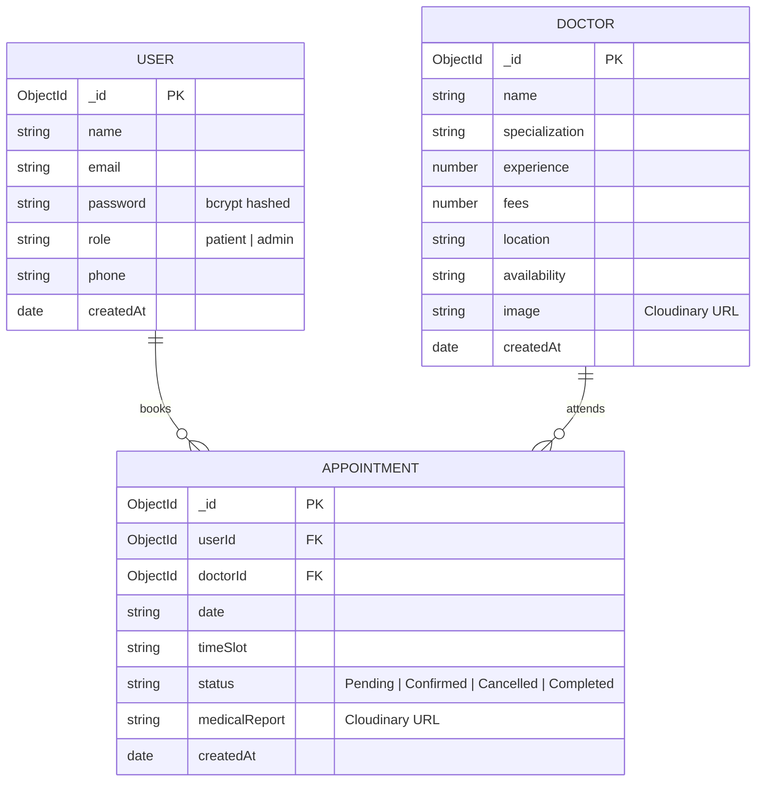
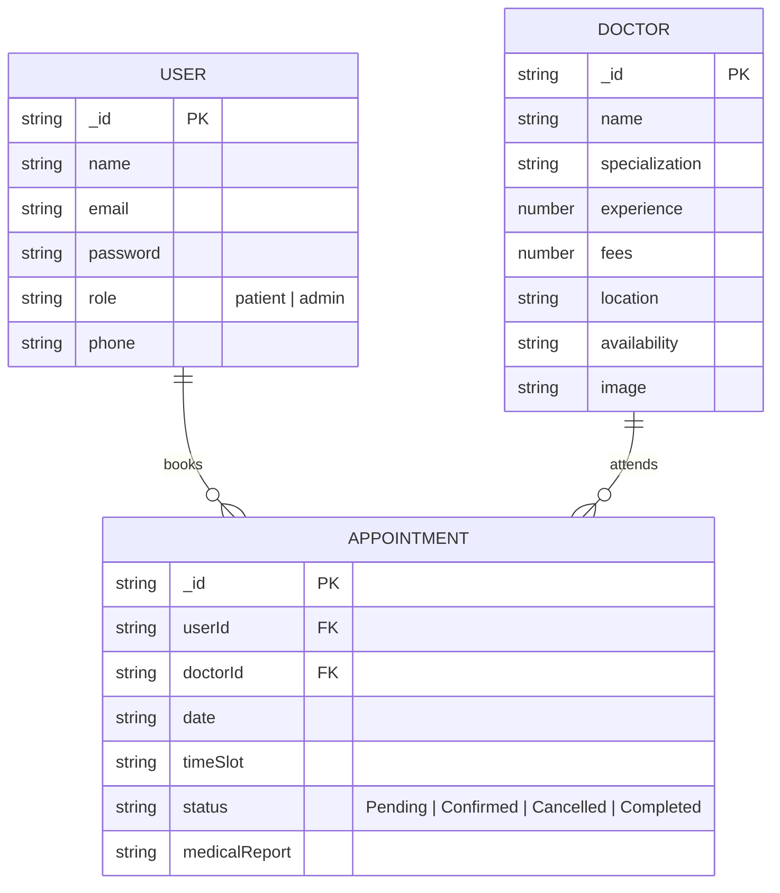

<div align="center">

# 🏥 BOOK-A-DOCTOR

### *Your One-Stop Platform for Effortless Online Doctor Appointments*

[](https://reactjs.org/)
[](https://nodejs.org/)
[](https://expressjs.com/)
[](https://mongodb.com/)
[](https://jwt.io/)
[](https://cloudinary.com/)
[](https://vercel.com/)
[](https://render.com/)

---

### 🔗 Quick Links

| 🌐 Live App | ⚡ Backend API | 📦 GitHub |
|:-----------:|:--------------:|:---------:|
| [Frontend (Vercel)](https://book-a-doctor-silk.vercel.app) | [Backend (Render)](https://book-a-doctor-h6gh.onrender.com) | [Repository](https://github.com/harineem2006/BOOK-A-DOCTOR) |

> [!IMPORTANT]
> **🔑 Pre-configured Admin Account for Demo:**
> - **Email:** `admin@gmail.com`
> - **Password:** `admin123`

</div>

---

## 📖 Table of Contents

- [✨ Features](#-features)
- [🏗️ Architecture](#-architecture)
- [📊 ER Diagram](#-er-diagram)
- [🗂️ Folder Structure](#-folder-structure)
- [⚙️ Setup & Installation](#-setup--installation)
- [🚀 Running the App](#-running-the-app)
- [📡 API Reference](#-api-reference)
- [🌐 Deployment](#-deployment)
- [📂 Project Documentation](#-project-documentation)
- [🧰 Tech Stack](#-tech-stack)

---

## ✨ Features

<table>
<tr>
<td width="50%">

### 👤 Patient Features
- 🔍 **Browse Doctors** — Search & filter by specialization, experience, fees
- 📅 **Book Appointments** — Pick date & time slot instantly
- 📋 **Dashboard** — Track all appointment statuses in real-time
- 📁 **Upload Reports** — Securely attach medical documents to appointments
- 🔐 **Auth** — Register/Login with JWT-protected sessions

</td>
<td width="50%">

### 🛡️ Admin Features
- 👨‍⚕️ **Doctor Management** — Add, edit, remove doctor listings
- 📊 **Appointment Oversight** — View & update all platform bookings
- 👥 **User Management** — Monitor all registered patient accounts
- 🏥 **Specialization Control** — Manage specializations & pricing
- 🔑 **Secure Admin Console** — Protected admin-only routes

</td>
</tr>
</table>

### Appointment Status Lifecycle

```
[Pending] ──► [Confirmed] ──► [Completed]
    │
    └──────────────────────► [Cancelled]
```

---

## 🏗️ Architecture

The application follows a **decoupled MERN Stack architecture** with a React SPA frontend communicating via REST API to a Node.js/Express backend, persisting data in MongoDB.

```
┌─────────────────────────────────────────────────────────────────────┐
│                         FRONTEND LAYER                              │
│  React 18 • React Router DOM v6 • Context API • Axios              │
│  Pages: Home | Doctors | DoctorProfile | BookAppointment            │
│          MyAppointments | UploadReports | AdminDashboard            │
│  Styling: Vanilla CSS + Glassmorphism Design System                 │
└─────────────────────────────────────────────────────────────────────┘
                               │
                    REST API (HTTP / JSON / JWT)
                               │
                               ▼
┌─────────────────────────────────────────────────────────────────────┐
│                         BACKEND LAYER                               │
│  Node.js & Express.js REST API Server                               │
│  JWT Authentication • Bcrypt Hashing • Express Validator            │
│  Controllers: Auth | Doctor | Appointment | Admin | Upload          │
│  Middleware: authMiddleware | uploadMiddleware | errorHandler        │
└─────────────────────────────────────────────────────────────────────┘
                               │
                       Mongoose ORM
                               │
                               ▼
┌─────────────────────────────────────────────────────────────────────┐
│                         DATABASE LAYER                              │
│  MongoDB  •  Collections: Users | Doctors | Appointments            │
└─────────────────────────────────────────────────────────────────────┘
                               │
                    Cloudinary (Cloud Storage)
                               │
                               ▼
              ┌─────────────────────────────────┐
              │  Medical Reports & Doctor Images │
              └─────────────────────────────────┘
```

### MVC Pattern

| Layer | Location | Responsibility |
|-------|----------|----------------|
| **Model** | `server/models/` | Mongoose schemas — `User.js`, `Doctor.js`, `Appointment.js` |
| **View** | `client/src/` | React components, pages, context, services |
| **Controller** | `server/controllers/` | Business logic, CRUD ops, JSON responses |

---

## 📊 ER Diagram



---

## 🗂️ Folder Structure

```
Book-A-Doctor/
├── 📁 client/                    # React Frontend App
│   ├── public/                   # Public assets & HTML template
│   ├── src/
│   │   ├── assets/               # Images, icons
│   │   ├── components/           # Reusable UI (Navbar, Footer, Cards...)
│   │   ├── context/              # Global Auth state (AuthContext.js)
│   │   ├── hooks/                # Custom React hooks
│   │   ├── pages/                # Route-level page components
│   │   │   ├── Home/
│   │   │   ├── Doctors/
│   │   │   ├── DoctorProfile/
│   │   │   ├── BookAppointment/
│   │   │   ├── MyAppointments/
│   │   │   ├── UploadReports/
│   │   │   ├── AdminLogin/
│   │   │   ├── AdminDashboard/
│   │   │   ├── Login/
│   │   │   ├── Register/
│   │   │   └── NotFound/
│   │   ├── services/             # Axios API service layer
│   │   └── utils/                # Helper utilities & ProtectedRoute
│   └── vercel.json               # Vercel deployment config
│
├── 📁 server/                    # Node.js + Express Backend REST API
│   ├── config/                   # Database & Cloudinary configuration
│   ├── controllers/              # API Business Logic
│   │   ├── authController.js
│   │   ├── doctorController.js
│   │   ├── appointmentController.js
│   │   ├── adminController.js
│   │   └── uploadController.js
│   ├── middleware/               # Auth, Upload & Error Handler Middlewares
│   ├── models/                   # Mongoose Schemas
│   │   ├── User.js
│   │   ├── Doctor.js
│   │   └── Appointment.js
│   ├── routes/                   # Express API Route Definitions
│   ├── services/                 # External service integrations
│   ├── utils/                    # Helper utilities & validators
│   ├── seedAdmin.js              # Seed default admin account
│   ├── seedDoctors.js            # Seed sample doctor profiles
│   └── server.js                 # App entry point
│
├── 📁 docs/                      # Project Documentation PDFs
│   ├── API_Documentation.pdf
│   ├── Database_Design.pdf
│   └── Project_Report.pdf
│
├── 📁 postman/                   # Postman API Test Collection
├── .gitignore
├── package.json                  # Root workspace scripts
└── README.md
```

---

## ⚙️ Setup & Installation

### Prerequisites

- **Node.js** v18+ and **npm** v9+
- **MongoDB** (local instance or MongoDB Atlas URI)
- **Cloudinary** account (for file uploads)
- **Git**

### Environment Variables

#### `server/.env`

```env
PORT=5000
MONGO_URI=mongodb://127.0.0.1:27017/book-a-doctor
JWT_SECRET=your_jwt_secret_key
CLOUDINARY_CLOUD_NAME=your_cloud_name
CLOUDINARY_API_KEY=your_api_key
CLOUDINARY_API_SECRET=your_api_secret
```

#### `client/.env`

```env
REACT_APP_API_URL=http://localhost:5000/api
```

### 1. Clone the Repository

```bash
git clone https://github.com/harineem2006/BOOK-A-DOCTOR.git
cd BOOK-A-DOCTOR
```

### 2. Install Dependencies

```bash
# Install root dependencies
npm install

# Install server dependencies
cd server && npm install

# Install client dependencies
cd ../client && npm install
```

### 3. Seed the Database

```bash
cd server

# Create default admin account (admin@gmail.com / admin123)
node seedAdmin.js

# Seed sample doctor profiles
node seedDoctors.js
```

---

## 🚀 Running the App

### Development Mode (Both servers concurrently)

```bash
# From the root directory
npm run dev
```

### Individual Servers

```bash
# Backend API — http://localhost:5000
cd server && npm run dev

# Frontend React App — http://localhost:3000
cd client && npm start
```

---

## 📡 API Reference

### Base URL
- **Local:** `http://localhost:5000/api`
- **Production:** `https://book-a-doctor-h6gh.onrender.com/api`

### Endpoints

| Method | Endpoint | Auth | Description |
|--------|----------|------|-------------|
| `POST` | `/auth/register` | ❌ Public | Register new patient |
| `POST` | `/auth/login` | ❌ Public | Login & get JWT token |
| `GET` | `/doctors` | ❌ Public | Get all doctors (with filters) |
| `GET` | `/doctors/:id` | ❌ Public | Get single doctor profile |
| `POST` | `/appointments` | ✅ Patient | Book an appointment |
| `GET` | `/appointments/my` | ✅ Patient | Get user's appointments |
| `PUT` | `/appointments/:id/cancel` | ✅ Patient | Cancel an appointment |
| `POST` | `/upload/:appointmentId` | ✅ Patient | Upload medical report |
| `GET` | `/admin/appointments` | ✅ Admin | Get all appointments |
| `PUT` | `/admin/appointments/:id` | ✅ Admin | Update appointment status |
| `GET` | `/admin/doctors` | ✅ Admin | Get all doctors |
| `POST` | `/admin/doctors` | ✅ Admin | Add new doctor |
| `PUT` | `/admin/doctors/:id` | ✅ Admin | Update doctor details |
| `DELETE` | `/admin/doctors/:id` | ✅ Admin | Remove a doctor |
| `GET` | `/admin/users` | ✅ Admin | Get all users |

> [!NOTE]
> Full API documentation with request/response schemas is available in [`docs/API_Documentation.pdf`](./docs/API_Documentation.pdf).

---

## 🌐 Deployment

### Frontend — Vercel

The React client is deployed on **Vercel** with the `vercel.json` config handling SPA routing:

```json
{
  "rewrites": [{ "source": "/(.*)", "destination": "/index.html" }]
}
```

Set the following environment variable in Vercel:
```
REACT_APP_API_URL = https://book-a-doctor-h6gh.onrender.com/api
```

### Backend — Render

The Express server is deployed on **Render** (free tier). Set all `server/.env` variables as Render environment variables.

> [!WARNING]
> Render free tier instances spin down after 15 minutes of inactivity. The first request after idle may take ~30 seconds to respond.

---

## 📂 Project Documentation

All project documentation is available via the links below:

| Document | Description | Link |
|----------|-------------|------|
| 📄 **API Documentation** | REST API endpoint specs with examples | [`docs/API_Documentation.pdf`](./docs/API_Documentation.pdf) |
| 🗄️ **Database Design** | MongoDB schema & ER diagrams | [`docs/Database_Design.pdf`](./docs/Database_Design.pdf) |
| 📋 **Project Report** | Full project report & technical analysis | [`docs/Project_Report.pdf`](./docs/Project_Report.pdf) |
| 🧪 **Postman Collection** | API test collection for all endpoints | [`postman/`](./postman/) |

---

## 🧰 Tech Stack

### Frontend

| Technology | Version | Purpose |
|------------|---------|---------|
| React | 18 | UI Framework |
| React Router DOM | v6 | Client-side routing |
| Axios | Latest | HTTP requests to API |
| Context API | Built-in | Global auth state management |
| Vanilla CSS | — | Custom design system & glassmorphism |

### Backend

| Technology | Version | Purpose |
|------------|---------|---------|
| Node.js | 18+ | Server runtime |
| Express.js | 4.x | REST API framework |
| Mongoose | 8.x | MongoDB ORM |
| JSON Web Token | 9.x | Authentication |
| Bcryptjs | 2.x | Password hashing |
| Multer | 1.x | File upload handling |
| Cloudinary | 1.x | Cloud image/file storage |
| Express Validator | 7.x | Input validation |
| Nodemon | 3.x | Dev server auto-reload |

### Database & Infrastructure

| Service | Purpose |
|---------|---------|
| MongoDB | Primary database |
| Cloudinary | Medical reports & doctor image storage |
| Vercel | Frontend hosting & CDN |
| Render | Backend API hosting |

---

## 👤 User Flow

```
[ Visitor ]
     │
     ├──► Register / Login ──────────────────────────────────┐
     │                                                        │
     ▼                                                        ▼
[ Browse Doctors Catalog ]                          [ Patient Dashboard ]
     │                                                        │
     ├──► Filter by Specialization / Fees / Experience        ├──► View All Appointments
     │                                                        │
     └──► View Doctor Profile                                 ├──► Track Status
               │                                              │    (Pending/Confirmed/Completed)
               └──► Book Appointment                          │
                         │                                    └──► Upload Medical Reports
                         ├──► Select Date & Time Slot
                         └──► Appointment Confirmed ──► Admin Reviews & Updates Status
```

---

<div align="center">

### 📊 Demo & Evaluation Links Summary

| Resource | Link |
|----------|------|
| 🌐 **Live Frontend** | [book-a-doctor-silk.vercel.app](https://book-a-doctor-silk.vercel.app) |
| 🔍 **Browse Doctors** | [book-a-doctor-silk.vercel.app/doctors](https://book-a-doctor-silk.vercel.app/doctors) |
| ⚡ **Backend API** | [book-a-doctor-h6gh.onrender.com](https://book-a-doctor-h6gh.onrender.com) |
| 📦 **GitHub Repo** | [github.com/harineem2006/BOOK-A-DOCTOR](https://github.com/harineem2006/BOOK-A-DOCTOR) |

---

Made with ❤️ using the **MERN Stack**

</div>

---

## 🔗 DEMO AND GITHUB REPOSITORY LINKS

> [!IMPORTANT]
> - 🌐 **Live Vercel Frontend App:** [https://book-a-doctor-silk.vercel.app](https://book-a-doctor-silk.vercel.app)
> - 👨‍⚕️ **Browse Doctors:** [https://book-a-doctor-silk.vercel.app/doctors](https://book-a-doctor-silk.vercel.app/doctors)
> - ⚡ **Live Render Backend API:** [https://book-a-doctor-h6gh.onrender.com](https://book-a-doctor-h6gh.onrender.com)
> - 📦 **GitHub Repository:** [https://github.com/harineem2006/BOOK-A-DOCTOR](https://github.com/harineem2006/BOOK-A-DOCTOR)
> - 🔑 **Pre-configured Admin Account:**
>   - **Account Email:** `admin@gmail.com`
>   - **Password:** `admin123`

---

## 1. PROJECT ARCHITECTURE

### TECHNICAL ARCHITECTURE

The application follows a decoupled client-server architecture:

```
+-----------------------------------------------------------------------+
|                            FRONTEND LAYER                             |
|  - React 18                                                           |
|  - Custom CSS Design System & Responsive Layout Tokens                |
|  - Context API (AuthContext)                                          |
|  - React Router DOM Navigation                                        |
|  - Pages: Home, Doctors, DoctorProfile, BookAppointment,              |
|          MyAppointments, UploadReports, AdminLogin, AdminDashboard    |
+-----------------------------------------------------------------------+
                                    |
                                    | REST API (HTTP / JSON / JWT)
                                    v
+-----------------------------------------------------------------------+
|                            BACKEND LAYER                              |
|  - Node.js & Express.js REST API Server                               |
|  - JWT Authentication & Bcrypt Hashing Middleware                     |
|  - Controllers: AuthController, DoctorController,                     |
|                AppointmentController, AdminController, UploadController|
+-----------------------------------------------------------------------+
                                    |
                                    | Mongoose ORM
                                    v
+-----------------------------------------------------------------------+
|                            DATABASE LAYER                             |
|  - MongoDB (Users, Doctors, Appointments)                             |
+-----------------------------------------------------------------------+
```

---

### ER DIAGRAM



---

### FEATURES

1. **Comprehensive Doctor Catalog**: Extensive listing of certified doctors across specializations (Cardiology, Dermatology, Pediatrics, Neurology, Orthopedics) with real-time filtering, search keyword matching, experience level, and fee sorting.
2. **Book Appointment Flow**: Direct appointment booking workflow where patients select a doctor, pick their desired date and available time slot, and submit booking requests instantly.
3. **Medical Reports Upload**: Secure file upload system for medical reports and lab documents associated directly with appointment records using Cloudinary and Multer.
4. **User Profile & Tracking**: Dedicated patient dashboard displaying appointment history alongside live status updates (`Pending`, `Confirmed`, `Completed`, `Cancelled`).
5. **Unified Admin Console (`admin@gmail.com` / `admin123`)**:
   - **Doctor Management**: Add new doctors, update specializations, edit pricing/schedules, and remove doctor listings.
   - **Appointment Oversight**: View all platform bookings and update appointment status.
   - **User Management**: Monitor registered user accounts.

---

### USER FLOW

```
[ Visitor / Patient ]
         |
         v
[ Browse Home / Doctor Catalog ]
         |
         +----> Click "Doctor Profile" ---> View Specialization, Fees & Schedule
         |
         +----> Click "Book Appointment" ---> Select Date, Slot & Upload Reports
                                                     |
                                                     v
                                            [ Appointment Booked ]
                                                     |
                                                     v
                                          [ Track Status in Dashboard ]
```

---

### MVC PATTERN EXPLANATION

- **Model Layer (`server/models/`)**: Mongoose models defining data schemas for `User.js`, `Doctor.js`, and `Appointment.js`.
- **View Layer (`client/src/`)**: Dynamic React components rendered with CSS styling, responsive grid structures, and interactive UI states.
- **Controller Layer (`server/controllers/`)**: Business logic processing incoming API requests, performing database CRUD operations, and returning structured JSON responses (`authController.js`, `doctorController.js`, `appointmentController.js`, `adminController.js`, `uploadController.js`).

---

## 2. PROJECT SETUP AND CONFIGURATION

### Folder Structure

```
Book-A-Doctor/
├── client/              # React Frontend App
│   ├── public/          # Public assets & HTML template
│   └── src/             # Components, Pages, Context, Services
├── server/              # Node.js + Express Backend REST API
│   ├── config/          # Database & Cloudinary configs
│   ├── controllers/     # API Business Logic
│   ├── middleware/      # Auth, Upload & Error Handler Middlewares
│   ├── models/          # Mongoose Schemas
│   ├── routes/          # Express API Endpoints
│   └── uploads/         # Local File Storage Fallback
├── docs/                # Project Documentation & Architecture PDFs
├── postman/             # Postman API Test Collection
└── README.md
```

### Installation Steps

#### 1. Server Setup:
```bash
cd server
npm install
```

#### 2. Client Setup:
```bash
cd ../client
npm install
```

---

## 3. BACKEND DEVELOPMENT

### Backend Server Configuration (`server/server.js` & `server/app.js`)
- **Express App Mounting Routes:** `/api/auth`, `/api/doctors`, `/api/appointments`, `/api/upload`, `/api/admin`
- **Middleware:** CORS enabled, JSON body parsing, URL-encoded payload handling, JWT authentication, and centralized error handling.

### Database Seeding:
Populates default admin account (`admin@gmail.com` / `admin123`) and sample doctor profiles:
```bash
cd server
node seedAdmin.js
node seedDoctors.js
```

---

## 4. DATABASE DEVELOPMENT (MongoDB)

- **MongoDB URI:** `mongodb://127.0.0.1:27017/book-a-doctor` (or via `MONGO_URI` in `server/.env`)
- **Database Connector:** `server/config/db.js` using Mongoose ORM.

---

## 5. FRONTEND DEVELOPMENT

Built with **React 18**, **React Router DOM v6**, **Axios**, and **Vanilla CSS** featuring:
- Custom Glassmorphism & Modern Card Design Tokens (`DoctorCard`, `AppointmentCard`, `Navbar`, `Footer`)
- Protected Routes for Patient Dashboard and Admin Console (`ProtectedRoute.jsx`)
- Global Authentication State via React Context API (`AuthContext.js`)

---

## 6. PROJECT EXECUTION

### Step 1: Start Backend API Server
```bash
cd server
npm run dev
# Running on http://localhost:5000
```

### Step 2: Start Frontend React Server
```bash
cd client
npm start
# Running on http://localhost:3000
```

---

## 📂 PROJECT DOCUMENTATION

All project documentation (reports, architecture diagrams, API specs, and database design) is available via the links below:

| Document | Description | Link |
|---|---|---|
| 📄 API Documentation | REST API endpoint specifications | `docs/API_Documentation.pdf` |
| 🗄️ Database Design | MongoDB schema & ER diagrams | `docs/Database_Design.pdf` |
| 📋 Project Report | Full project report & analysis | `docs/Project_Report.pdf` |

---

## 📊 DEMO & EVALUATION LINKS SUMMARY

- **Live Vercel Frontend App:** [https://book-a-doctor-silk.vercel.app](https://book-a-doctor-silk.vercel.app)
- **GitHub Repository:** [https://github.com/harineem2006/BOOK-A-DOCTOR](https://github.com/harineem2006/BOOK-A-DOCTOR)
- **Live Render Backend API:** [https://book-a-doctor-h6gh.onrender.com](https://book-a-doctor-h6gh.onrender.com)
- **Admin Email:** `admin@gmail.com`
- **Admin Password:** `admin123`